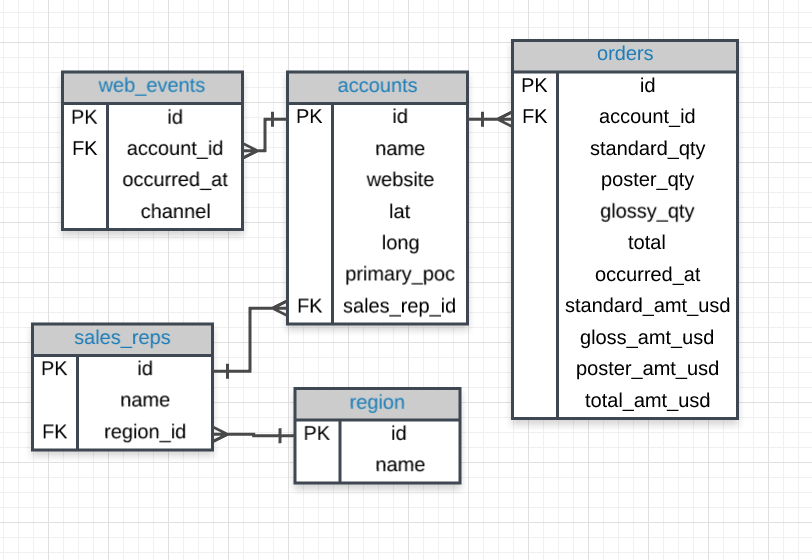
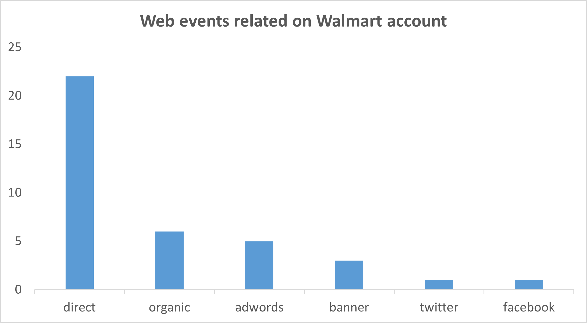

# <center> PARCH AND POSEY SQL ANALYSIS </center>

<p align="center">  </p>

#### Parch and Posey is a fictional paper-selling company, which has 50 sales representatives across four regions in the United States. They sell 3 types of paper: standard, glossy and poster. The clients were attracted by advertinsing on Google, Facebook and Twitter. 
#### This database contains following tables:
* **accounts:** all accounts from Parch and Posey
* **orders:** all orders made from 2014-12-03 to 2017-01-01
* **regions:** the 4 regions in the United States where Parch and Posey operates
* **sales_reps:** information on Parch and Posey's sales representatives
* **web_events:** all web event data for Parch and Posey's accounts
#### Now, we'll explore a postgres database using SQL, bearing in mind the schema above, in order to answer business questions.

### Q1. Providing all web events associated with Walmart account.
```
SELECT name, channel, occurred_at
FROM web_events
LEFT JOIN accounts 
ON web_events.account_id = accounts.id
WHERE name = 'Walmart'
ORDER BY occurred_at
```
<p align="left">  </p>
